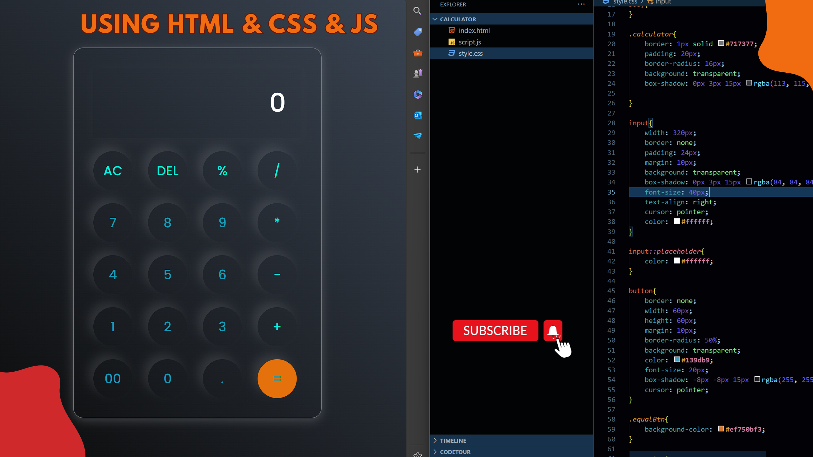

# Calculator Using HTML, CSS, and JS Git Repo
This repository contains a simple calculator built using HTML, CSS, and JavaScript. The calculator has a basic layout with a display screen and a keypad with numbers and operators. The user can input numbers and operators to perform calculations, and the result will be displayed on the screen.

# Screenshots

calculator

# Tutorial is available on youtube channel 
click on the link to see :- ([Open in Youtube](https://youtu.be/FZGK5ifwY-I))

# Features

Basic arithmetic operations (addition, subtraction, multiplication, division)
Support for multiple digit numbers
Light and dark mode feature
Responsive design

# snake.coding
We create a project each 4 days with voting on our <a href="https://youtube.com/@snakecoding_12" target="_blank">Youtube</a> channel.
You can vote for upcoming projects on our channel **community** page :wink:
